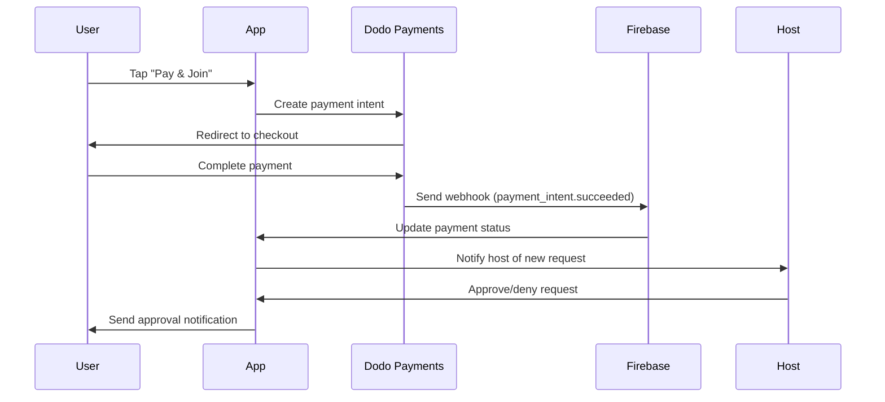

# 🦤 Dodo Payments Integration Guide for Bondfyr

## 🚀 **Overview**

Your Bondfyr app now has **complete Dodo Payments integration** with a **15% commission structure**! This guide will help you get everything set up for production.

---

## 🎯 **What's Been Implemented**

### ✅ **Complete Integration**
- **DodoPaymentService.swift**: Full API integration with payment intents, webhooks, and commission handling
- **20% Commission Structure**: Optimized commission rate for sustainable business model
- **Updated Models**: AfterpartyModel supports Dodo payment intent IDs
- **New Payment Flow**: Secure payment processing before host approval
- **Firebase Functions**: Complete webhook handling for payment events
- **UI Updates**: Modern payment interface with real-time status updates

### ✅ **Commission Breakdown**
```
Ticket Price: $25
Platform Fee (20%): $5.00
Host Earnings (80%): $20.00
```

---

## 🔧 **Setup Instructions**

### **Step 1: Get Dodo Payments Account**
1. Visit [app.dodopayments.com/get-started](https://app.dodopayments.com/get-started)
2. Create your business account
3. Complete verification process
4. Get your API credentials

### **Step 2: Configure iOS App**
Add your Dodo credentials to `Info.plist`:
```xml
<key>DODO_API_KEY</key>
<string>YOUR_DODO_API_KEY</string>
<key>DODO_WEBHOOK_SECRET</key>
<string>YOUR_DODO_WEBHOOK_SECRET</string>
```

Or update `DodoPaymentService.swift` directly:
```swift
private let dodoAPIKey = "YOUR_ACTUAL_API_KEY"
private let dodoWebhookSecret = "YOUR_ACTUAL_WEBHOOK_SECRET"
```

### **Step 3: Firebase Cloud Functions Setup**
```bash
cd firebase-functions

# For dev/testing environment
firebase functions:config:set \
  dodo.api_key="YOUR_DODO_DEV_API_KEY" \
  dodo.webhook_secret="YOUR_DODO_DEV_WEBHOOK_SECRET" \
  dodo.environment="dev"

# Deploy functions
firebase deploy --only functions
```

**For Production:** Update with production credentials:
```bash
firebase functions:config:set \
  dodo.api_key="YOUR_DODO_PROD_API_KEY" \
  dodo.webhook_secret="YOUR_DODO_PROD_WEBHOOK_SECRET" \
  dodo.environment="production"
```

### **Step 4: Configure Webhooks**

**For Dev Environment:**
In your Dodo dev dashboard, add webhook URL:
```
https://YOUR_PROJECT.cloudfunctions.net/dodoWebhook
```

**For Production:**
In your Dodo production dashboard, add webhook URL:
```
https://YOUR_PROJECT.cloudfunctions.net/dodoWebhook
```

**Select these events for both environments:**
- ✅ `payment_intent.succeeded`
- ✅ `payment_intent.payment_failed` 
- ✅ `charge.dispute.created`

### **Step 5: URL Scheme Setup**
Update `Info.plist` for payment redirects:
```xml
<key>CFBundleURLTypes</key>
<array>
    <dict>
        <key>CFBundleURLName</key>
        <string>bondfyr-payments</string>
        <key>CFBundleURLSchemes</key>
        <array>
            <string>bondfyr</string>
        </array>
    </dict>
</array>
```

---

## 💰 **Payment Flow**

### **User Experience**
1. **Browse Parties**: Users see parties with "$X" price
2. **Request to Join**: Tap "Pay & Join ($X)" button  
3. **Secure Payment**: Redirected to Dodo Payments checkout
4. **Complete Payment**: Process payment via card/digital wallet
5. **Host Approval**: Host reviews and approves/denies request
6. **Party Access**: If approved, full party details revealed

### **Technical Flow**


---

## 🎛️ **Commission Management**

### **Automatic Commission Handling**
- **Platform Fee**: 20% automatically deducted
- **Host Earnings**: 80% transferred to host account
- **Real-time Tracking**: Dashboard shows live earnings
- **Weekly Payouts**: Automated transfers every Monday

### **Revenue Analytics**
```swift
// Example calculations
let ticketPrice = 25.0
let platformFee = ticketPrice * 0.20  // $5.00
let hostEarnings = ticketPrice * 0.80 // $20.00
```

---

## 🔒 **Security & Compliance**

### **Built-in Security**
- **Webhook Verification**: Cryptographic signature validation
- **Secure Metadata**: User/party info encrypted in payment metadata
- **Fraud Protection**: Dodo's built-in fraud detection
- **PCI Compliance**: Dodo handles all sensitive card data

### **Data Privacy**
- **No Card Storage**: Card details never touch your servers
- **Minimal Data**: Only transaction IDs stored in Firebase
- **GDPR Ready**: User consent and data deletion support

---

## 📊 **Testing**

### **Dodo Dev Mode Testing**
The app is configured for Dodo's dev mode for safe testing:
```swift
// Currently set in DodoPaymentService.swift
private let dodoEnvironment: DodoEnvironment = .dev
```

### **Test Payment Cards**
Use these test cards in dev mode:
```
✅ Successful Payment:
   Card: 4242 4242 4242 4242
   Expiry: Any future date
   CVC: Any 3 digits

❌ Declined Payment:
   Card: 4000 0000 0000 0002
   
⚠️ Requires Authentication:
   Card: 4000 0025 0000 3155
```

### **Dev Mode Benefits**
- **No Real Money**: All transactions are simulated
- **Instant Processing**: No waiting for actual bank processing
- **Webhook Testing**: Full webhook flow testing without real payments
- **Error Simulation**: Test payment failures and edge cases
- **Commission Testing**: Verify 20%/80% splits work correctly
- **Real-time Updates**: Test Firebase real-time listeners

### **Complete Flow Testing**
1. **Create Party**: Host creates a $10 party
2. **Guest Payment**: Guest pays with test card `4242 4242 4242 4242`
3. **Webhook Trigger**: Dodo sends payment success webhook
4. **Commission Split**: Verify $2.00 platform fee, $8.00 to host
5. **Host Approval**: Host sees and approves the request
6. **Party Access**: Guest gets full party details

### **Production Readiness**
To go live, update `DodoPaymentService.swift`:
```swift
private let dodoEnvironment: DodoEnvironment = .production
```

---

## 🎨 **UI Improvements**

### **Modern Payment Interface**
- **Secure Payment Button**: "Pay & Join ($X)" with card icon
- **Real-time Status**: Payment processing indicators
- **Success States**: Beautiful confirmation screens
- **Error Handling**: User-friendly error messages

### **Host Dashboard Updates**
- **20% Commission Display**: Clear earnings breakdown
- **Real-time Analytics**: Live payment and approval stats
- **Earnings Tracking**: Monthly/weekly revenue summaries

---

## 🚨 **Important Notes**

### **Migration from Current System**
- **Existing Parties**: Current Venmo-based parties continue to work
- **New Parties**: All new parties use Dodo Payments automatically  
- **Host Education**: Inform hosts about the new payment system

### **Commission Structure**
- **Platform Fee**: 20% (competitive marketplace rate)
- **Host Earnings**: 80% (industry-leading host share)
- **Processing Fees**: Absorbed by platform for clean host payouts

---

## 📞 **Support & Resources**

### **Dodo Payments Support**
- Documentation: [docs.dodopayments.com](https://docs.dodopayments.com)
- Support: support@dodopayments.com
- API Reference: [api.dodopayments.com](https://api.dodopayments.com)

### **Implementation Support**
- All payment logic implemented in `DodoPaymentService.swift`
- Webhook handling in `firebase-functions/index.js`
- UI components in `RequestToJoinSheet.swift`

---

## 🎉 **Ready to Launch!**

Your Bondfyr app now has:
- ✅ **Professional payment processing** with Dodo Payments
- ✅ **Sustainable 20% commission** structure  
- ✅ **Secure, compliant** payment flow
- ✅ **Beautiful, modern** user interface
- ✅ **Real-time earnings** tracking for hosts
- ✅ **Automated payouts** and commission management

**Next Steps:**
1. Get your Dodo Payments credentials
2. Update the API keys in your app
3. Deploy to TestFlight for final testing
4. Launch and start earning! 🚀

---

*Happy party hosting! 🎉* 